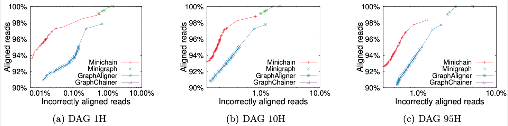

## <a name="started"></a>Getting Started

```sh
git clone https://github.com/at-cg/minichain
cd minichain && make
# Map sequence to graph
./minichain -cx lr test/MT.gfa test/MT-orangA.fa > out.gaf
# Incremental graph generation (-l5k -d5k necessary for this toy example)
./minichain -cxggs -l5k -d5k test/MT-human.fa test/MT-chimp.fa test/MT-orangA.fa > out.gfa
```

## Table of Contents

- [Getting Started](#started)
- [Introduction](#intro)
- [User's Guide](#uguide)
  - [Installation](#install)
  - [Read mapping](#map)
  - [Graph generation](#ggen)
- [Benchmark](#benchmark)
- [Future work](#future_work)
- [Publications](#pub)

## <a name="intro"></a>Introduction

Minichain is designed to align long reads to pangenome graphs represented as DAGs. It can scale to pangenomes built from several human genome assemblies. We have designed and implemented a new provably-good gap-sensitive co-linear chaining algorithm for filtering anchors (see [paper](#pub) for details). This algorithm enables accurate and fast long read alignments. Minichain uses seeding and base-to-base alignment code from [minigraph][minigraph].

## <a name="uguide"></a>User's Guide

### <a name="install"></a>Installation

#### Dependencies
1) [gcc9][gcc9] or later version
2) [zlib][zlib]


### <a name="map"></a>Read mapping
Minichain can be used for both sequence-to-sequence alignment as well as sequence-to-graph alignment. A graph should be provided in either [GFA][gfa1] or [rGFA][rgfa] format. Users can run quick tests on [sample data](test/) using the following commands. The alignment output is provided in [PAF](https://github.com/lh3/miniasm/blob/master/PAF.md) or [GAF](https://github.com/lh3/gfatools/blob/master/doc/rGFA.md#the-graph-alignment-format-gaf) format respectively.
```sh
# Map sequence to sequence
./minichain -cx lr test/MT-human.fa test/MT-orangA.fa > out.paf
# Map sequence to graph
./minichain -cx lr test/MT.gfa test/MT-orangA.fa > out.gaf
```

### <a name="ggen"></a>Graph generation
Minichain can be used for the incremental graph generation. Sequences should be provided in FASTA format. Users can run quick tests on [sample data](test/) using the following command. The graph output is provided in [rGFA][rgfa] format.
```sh
# Incremental graph generation (-l5k -d5k necessary for this toy example)
./minichain -cxggs -l5k -d5k test/MT-human.fa test/MT-chimp.fa test/MT-orangA.fa > out.gfa
```

## <a name="bench"></a>Benchmark
We have compared Minichain (v1.1) with existing sequence to graph aligners to demonstrate scalability and accuracy gains. Our experiments used human pangenome DAGs built by using subsets of [94 high quality haplotype assemblies](https://github.com/human-pangenomics/HPP_Year1_Assemblies) provided by the Human Pangenome Reference Consortium, and [CHM13 human genome assembly](https://www.ncbi.nlm.nih.gov/assembly/GCA_009914755.4) provided by the Telomere-to-Telomere consortium. Using a simulated long read dataset with 0.5x coverage, and DAGs of three different sizes, we see superior read mapping precision. For the largest DAG constructed from all 95 haplotypes, Minichain used 13 minutes and 26 GB RAM with 32 threads.



Minichain (v1.1) can construct a human pangenome graph. Our experiments utilized [94 high quality haplotype assemblies](https://github.com/human-pangenomics/HPP_Year1_Assemblies) from the Human Pangenome Reference Consortium and [CHM13 human genome assembly](https://www.ncbi.nlm.nih.gov/assembly/GCA_009914755.4) from the Telomere-to-Telomere consortium. Minichain used 12 hours and 30 minutes to run and needed 300 GB of RAM along with 32 threads.

## <a name="future_work"></a>Future work
We plan to continue adding features in future releases. 

* Support for cyclic graphs, which can be either pangenome references or assembly graphs.

<!--- * Support for chromosome-long query sequences. This is needed for [incremental pangenome graph construction (https://github.com/lh3/minigraph/blob/master/doc/example1.png). -->

## <a name="pub"></a>Publications

- **Ghanshyam Chandra and Chirag Jain**. "[Sequence to graph alignment using gap-sensitive co-linear chaining](https://doi.org/10.1101/2022.08.29.505691)". *RECOMB*, 2023.

[minigraph]: https://github.com/lh3/minigraph
[zlib]: http://zlib.net/
[gcc9]: https://gcc.gnu.org/
[rgfa]: https://github.com/lh3/gfatools/blob/master/doc/rGFA.md
[gfa1]: https://github.com/GFA-spec/GFA-spec/blob/master/GFA1.md
