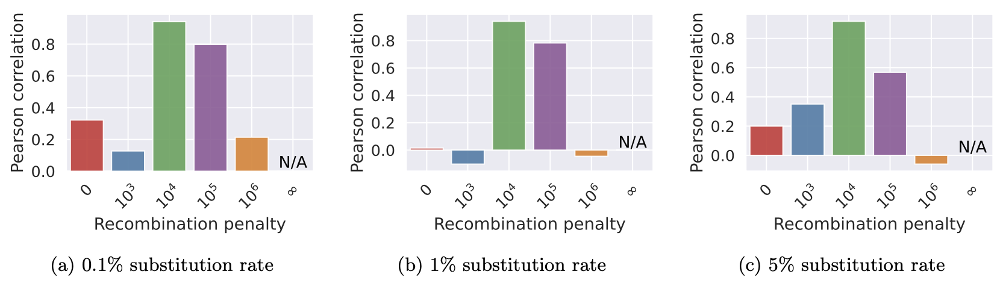
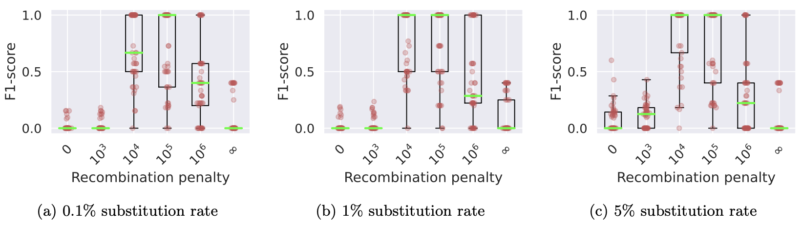

# <div align="center">Minichain</div>

## <div align="center">Long-read Aligner to Pangenome Graphs</div>

## <a name="started"></a>Getting Started

### Get Minichain

```bash
git clone https://github.com/at-cg/minichain
cd minichain && make
```

### Aligning sequence to haplotype-aware pangenome graph ([GFA v1.1](http://gfa-spec.github.io/GFA-spec/GFA1.html#gfa-11))

```bash
# Map sequence to haplotype-aware pangenome graph with Recombination penaly(R) 10000
./minichain -cx lr test/Graphs/C4-CHM13.gfa test/Genomes/C4-HG03492.2.fa -R10000 > C4-HG03492.2.gaf
```

### Aligning sequence to pangenome graph ([rGFA](https://github.com/lh3/gfatools/blob/master/doc/rGFA.md#the-reference-gfa-rgfa-format)/[GFA v1.0](http://gfa-spec.github.io/GFA-spec/GFA1.html))

```bash
# Map sequence to pangenome graph
./minichain -cx lr test/Graphs/C4-CHM13_mg.gfa test/Genomes/C4-HG03492.2.fa > C4-HG03492.2.gaf
```

## Table of Contents

- [Getting Started](#started)
- [Introduction](#intro)
- [User&#39;s Guide](#uguide)
  - [Installation](#install)
  - [Read mapping](#map)
  - [Graph generation](#ggen)
- [Benchmark](#benchmark)
- [Future work](#future_work)
- [Publications](#pub)

## <a name="intro"></a>Introduction

Minichain is a haplotype-aware long-read aligner to a pangenome graph represented as DAGs. Minichain is designed to align long reads or genome assemblies to pangenome graphs. It can scale to pangenomes built from several human genome assemblies. Minichain employs two provably-good algorithms:

- Gap-sensitive co-linear chaining algorithm ([GFA v1.0][gfa1], [rGFA][rgfa]).
- Haplotype-aware co-linear chaining algorithm ([GFA v1.1][gfa11]).

See our [publications](#pub) for algorithm details.

These algorithms enable accurate and fast long-read alignments. Minichain borrows seeding and base-to-base alignment code from [Minigraph][minigraph].

## <a name="uguide"></a>User's Guide

### <a name="install"></a>Installation

```bash
git clone https://github.com/at-cg/minichain
cd minichain && make
mkdir ~/bin && cp minichain ~/bin
echo "export PATH=~/bin:$PATH" >> ~/.bashrc && source ~/.bashrc
# Check installation
minichain --version
```

#### Dependencies

1) [gcc9][gcc9] or later version
2) [zlib][zlib]

### <a name="map"></a>Read mapping

Minichain can be used for both sequence-to-sequence alignment as well as sequence-to-graph alignment. A graph should be provided in either [GFA v1.0][gfa1], [rGFA][rgfa] or [GFA v1.1][gfa11] (haplotype-aware) format. 
Minichain automatically switches between haplotype-aware and haplotype-agnostic chaining algorithms based on the input pangenome graph.

Users can run quick tests on [sample data](test/) using the following commands. The alignment output is provided in [PAF](https://github.com/lh3/miniasm/blob/master/PAF.md) or [GAF](https://github.com/lh3/gfatools/blob/master/doc/rGFA.md#the-graph-alignment-format-gaf) format respectively.

```bash
# Map sequence to sequence
./minichain -cx lr test/Genomes/C4-CHM13.fa test/Genomes/C4-HG03492.2.fa > C4-HG03492.2.paf
# Map sequence to haplotype-aware pangenome graph with Recombination penaly(R) 10000
./minichain -cx lr test/Graphs/C4-CHM13.gfa test/Genomes/C4-HG03492.2.fa -R10000 > C4-HG03492.2.gaf
# Map sequence to pangenome graph
./minichain -cx lr test/Graphs/C4-CHM13_mg.gfa test/Genomes/C4-HG03492.2.fa > C4-HG03492.2.gaf

```

### <a name="ggen"></a>Graph generation

Minichain can be used for the incremental graph generation. Sequences should be provided in FASTA format. Users can run quick tests on [sample data](test/) using the following command. The graph output is provided in [rGFA][rgfa] format.

```sh
# Incremental graph generation
./minichain -cxggs test/Genomes/C4-CHM13.fa test/Genomes/C4-HG002.1.fa test/Genomes/C4-HG002.2.fa > C4-CHM13.gfa
```

## <a name="bench"></a>Benchmark

### v1.3

We have benchmarked Minichain (v1.3) and demonstrated that the chained haplotype paths are consistent with the true haplotype paths. To benchmark Minichain, we performed the following steps:

**Step 1:** Data Preparation
- To reproduce the results, we begin by downloading 61 major histocompatibility complex (MHC) genomes from the Human Pangenome Reference Consortium (HPRC), which are available on [Zenodo](https://zenodo.org/records/6617246).
- We utilize the MHC genome from the CHM13 cell line as the reference and exclude the GRCh38 cell line MHC genome.
- For the remaining 59 haplotypes, we generate a pangenome graph by augmenting structural variations (SVs) of at least 50 base pairs (bp) with [Minigraph](https://github.com/lh3/minigraph).
- Subsequently, we align each haplotype back to the pangenome graph with [Minigraph](https://github.com/lh3/minigraph) using `-cx asm` flag and augment the corresponding haplotype paths as `W` lines in the graph.

**Step 2:** Simulating Haplotypes
- We simulate 135 MHC haplotypes, creating a mosaic of haplotype paths derived from the graph and recording the true haplotype paths.
- We split the simulated haplotypes into three groups, each consisting of 45 haplotypes, with substitution error rates of 0.1%, 1%, and 5%.

**Step 3:** Alignment and Haplotype Switches
- The simulated MHC haplotypes are aligned to the MHC pangenome graph, and the chained haplotype paths are recorded.

**Step 4:** Evaluation Metrics
- Using the information from true haplotype paths and chained haplotype paths, we compute both the Pearson correlation coefficient and F1-scores.

**Step 5:** Results

- Results show that haplotype-aware co-linear chaining shows better consistency of recombination events as compared to haplotype-agnostic (Recombination penalty = 0) and haplotype-restricted (Recombination penalty = ∞).

<p align="center" id="Pearson">
  <a href="./data/v1.3/pearson.png">
    
  </a>
</p>

> Pearson correlation between the count of recombinations in Minichain’s output chain and the true
count.

<p align="center" id="F1-score">
  <a href="./data/v1.3/F1_score.png">
    
  </a>
</p>

> Box plots showing the levels of consistency between the haplotype recombination pairs in Minichain’s output chain and the ground-truth using different substitution rates and recombination penalties. Median values are highlighted with light green lines.

Scripts are provided in [data](./data/v1.3/) folder to reproduce the results.

### v1.2 and earlier versions

We have compared Minichain (v1.2) with existing sequence to graph aligners to demonstrate scalability and accuracy gains. Our experiments used human pangenome DAGs built by using subsets of [94 high-quality haplotype assemblies](https://github.com/human-pangenomics/HPP_Year1_Assemblies) provided by the Human Pangenome Reference Consortium, and [CHM13 human genome assembly](https://www.ncbi.nlm.nih.gov/assembly/GCA_009914755.4) provided by the Telomere-to-Telomere consortium. Using a simulated long read dataset with 0.5x coverage, and DAGs of three different sizes, we see superior read mapping precision ([as shown in the figure](#Plot)). For the largest DAG constructed from all 95 haplotypes, Minichain used 10 minutes and 25 GB RAM with 32 threads.

<p align="center" id="Plot">
  <a href="./data/v1.0/plot.png">
    
  </a>
</p>

**Real dataset:** We benchmarked Minichain (v1.2) for mapping the [UL ONT](https://s3-us-west-2.amazonaws.com/human-pangenomics/working/HPRC_PLUS/HG002/raw_data/nanopore/HG002_giab_ULfastqs_guppy3.2.4.fastq.gz) (#reads: 13589524, N50: 52464) reads from the Human Pangenome Reference Consortium with approximately 52X total coverage to the largest DAG constructed from all 95 haplotypes. Minichain took 13 hours and 28 minutes, utilizing 66 GB of RAM and 128 physical cores ([Perlmutter cpu node](https://docs.nersc.gov/systems/perlmutter/architecture/#cpu-nodes)) and aligned 86% of the sequencing throughput.

**Graph generation:** Minichain (v1.1) can construct a human pangenome graph. Our experiments utilized [94 high-quality haplotype assemblies](https://github.com/human-pangenomics/HPP_Year1_Assemblies) from the Human Pangenome Reference Consortium and [CHM13 human genome assembly](https://www.ncbi.nlm.nih.gov/assembly/GCA_009914755.4) from the Telomere-to-Telomere consortium. Minichain took 58 hours and 17 minutes, utilizing 483 GB of RAM and 32 threads ([Cori Large Memory node](https://docs.nersc.gov/systems/cori/#login-nodes)).

Scripts are provided in [data](./data/v1.0/) folder to reproduce the results.

## <a name="future_work"></a> Future work

We plan to continue adding features in future releases.

* Support for haplotype-aware base-to-base alignment.
* Support for haplotype-aware alignment on cyclic pangenome graphs.

<!--- * Support for chromosome-long query sequences. This is needed for [incremental pangenome graph construction (https://github.com/lh3/minigraph/blob/master/doc/example1.png). -->

## <a name="pub"></a> Publications

- **Ghanshyam Chandra and Chirag Jain**. "Haplotype-aware Sequence-to-Graph Alignment". *(under review)*.
- **Ghanshyam Chandra and Chirag Jain**. "[Sequence to Graph Alignment Using Gap-Sensitive Co-linear Chaining](https://doi.org/10.1101/2022.08.29.505691)". *RECOMB* 2023.

[minigraph]: https://github.com/lh3/minigraph
[zlib]: http://zlib.net/
[gcc9]: https://gcc.gnu.org/
[rgfa]: https://github.com/lh3/gfatools/blob/master/doc/rGFA.md
[gfa1]: https://github.com/GFA-spec/GFA-spec/blob/master/GFA1.md
[gfa11]: http://gfa-spec.github.io/GFA-spec/GFA1.html#gfa-11
